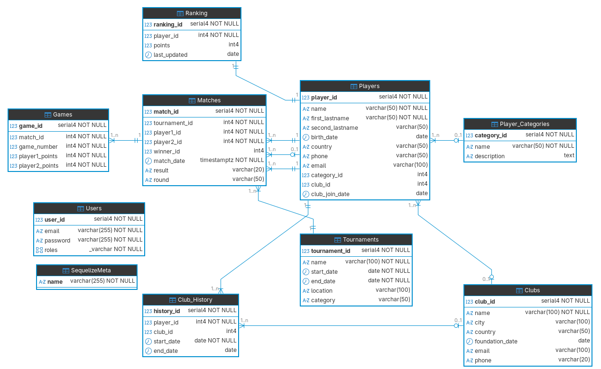
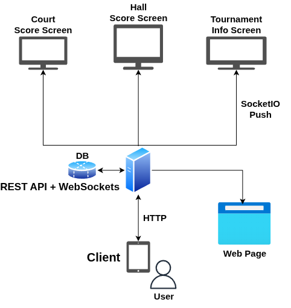

# squashAppBackend

This is an Express Server to handle the backend of the Squash Tournaments App

# Start the server

1. Enable the Database Container `docker-compose up -d` or `podman-compose up -d`
2. Run the Migrations `npm run db:migrate`
3. Run the Seeders `npm run db:seed`
4. Start the server `npm start`

# Routes

## Health Check

GET `/health` - Health Check Route

## Auth JWT

POST `/auth/signup` - Register a User  
POST `/auth/login` - Login User

GET `/auth/me` - Who am I (protected)

## Players

POST `/players` - Create Player

GET `/players` - Fetch All Players  
GET `/players/:id` - Fetch Single Player by id

PATCH `/players/:id` - Update Player by id

DELETE `/players/:id` - Delete Player by id

## Clubs

POST `/clubs` - Create Club

GET `/clubs` - Fetch All Clubs  
GET `/clubs/:id` - Fetch Single Club by id

PATCH `/clubs/:id` - Update Club by id

DELETE `/clubs/:id` - Delete Club by id

## Categories

POST `/categories` - Create Category

GET `/categories` - Fetch All Categories  
GET `/categories/:id` - Fetch Single Category by id

PATCH `/categories/:id` - Update Category by id

DELETE `/categories/:id` - Delete Category by id

## Matches

POST `/matches` - Create Match

GET `/matches` - Fetch All Matches  
GET `/matches/:id` - Fetch Single Match by id

PATCH `/matches/:id` - Update Match by id

DELETE `/matches/:id` - Delete Match by id

## Games

POST `/games` - Create Game

GET `/games` - Fetch All Games  
GET `/games/:id` - Fetch Single Game by id

PATCH `/games/:id` - Update Game by id

DELETE `/games/:id` - Delete Game by id

PATCH `games/:id/player1-scores` - Player 1 Score++

PATCH `games/:id/player2-scores` - Player 1 Score++

# Websockets

localhost:PORT - SocketIO server connection on the same port as the Express Server

## Socket IO Events Emmited

`player:created` - Event when a player is **created**  
`player:fetchAll` - Event when players are **fetched**  
`player:fetch` - Event when a single player is **fetched**  
`player:update` - Event when a player is **updated**  
`player:delete` - Event when a player is **deleted**

`player:score` - Event when the **Score gets updated**

# Database ERD Diagram

# System Diagram

# Postman JSON

The Postman Collection JSON is provided [Postman](SquashApp.postman_collection.json)
